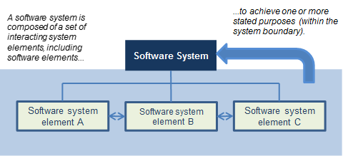
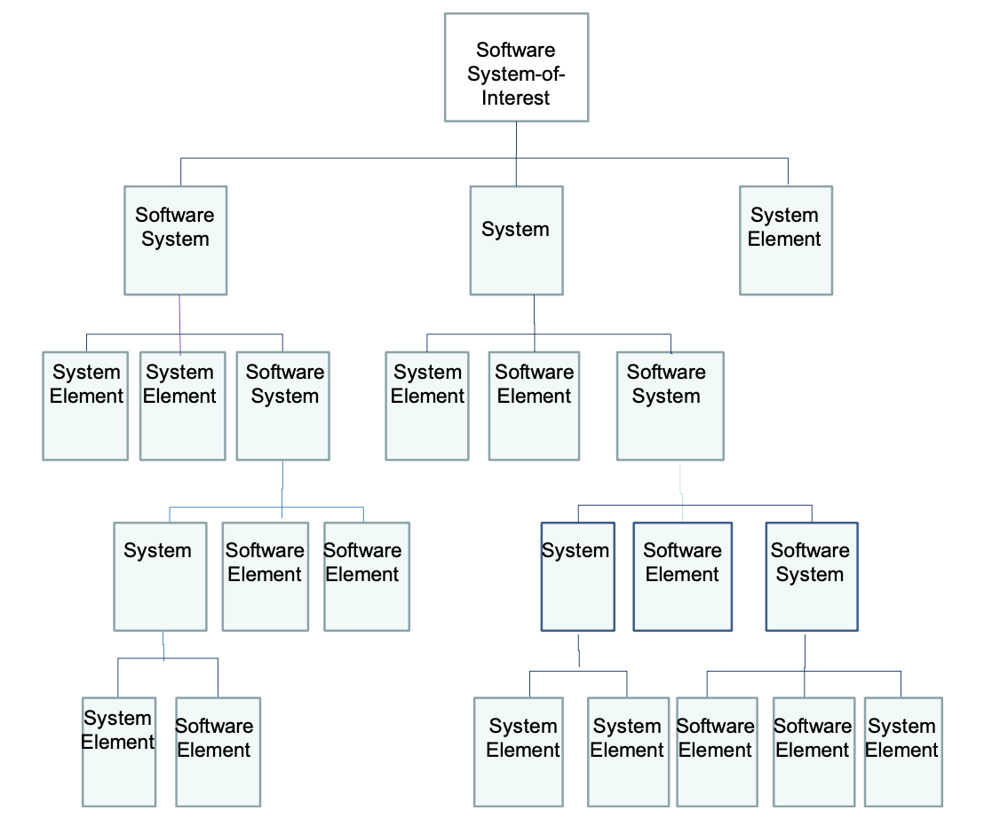
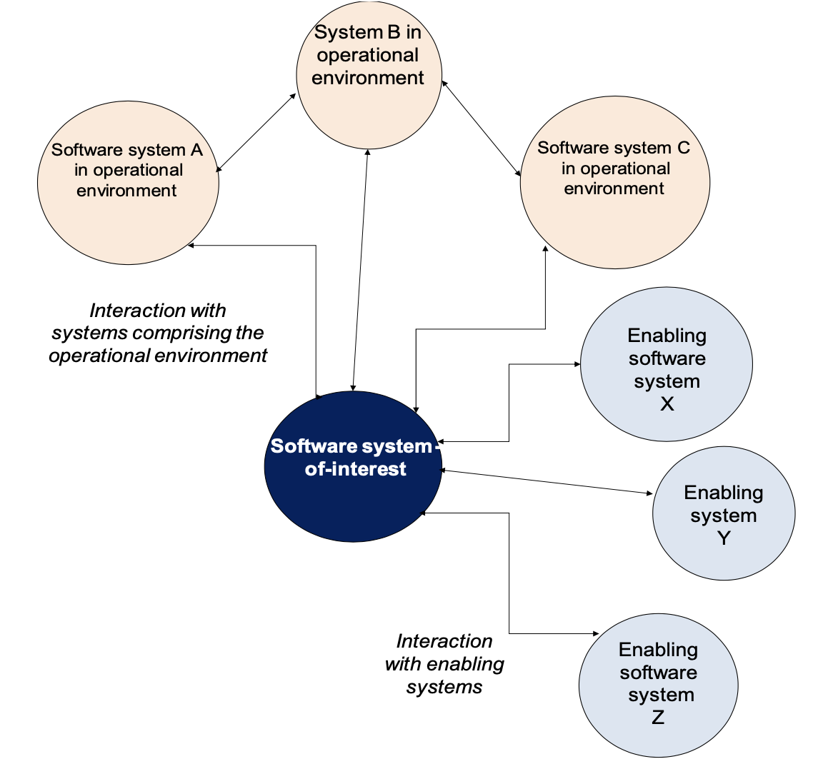
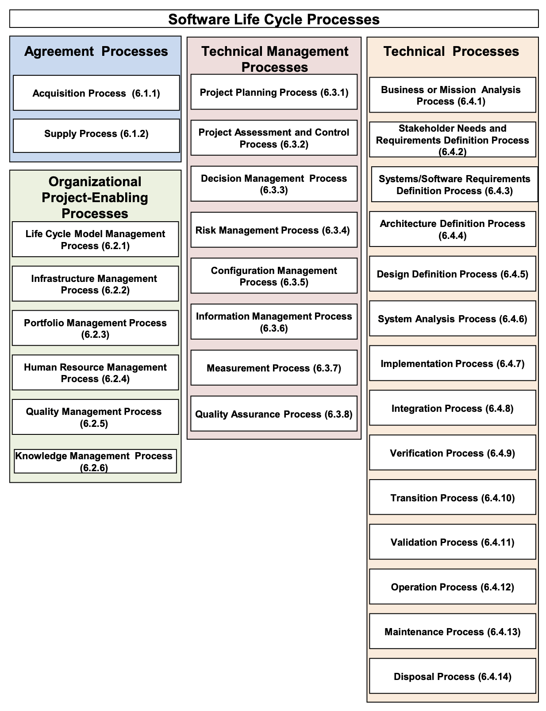

# 5 Key concepts and application

## 5.1 Introduction

This clause is included to highlight and to help explain essential concepts on which this document is based.

NOTE Further elaboration of these concepts can be found in ISO/IEC TS 24748‐1, ISO/IEC TR 24748‐2, and ISO/IEC TR24748‐3 on the application of life cycle management.

## 5.2 Software system concepts

### 5.2.1 Software systems

The software systems considered in this document are human‐made, created and utilized to provide products or services in defined environments for the benefit of users and other stakeholders. These software systems can include the following system elements: hardware, software, data, humans, processes (e.g., processes for providing service to users), procedures (e.g., operator instructions), facilities, services, materials and naturally occurring entities. As viewed by the user, they are thought of as products or services.

This document applies to systems for which software is of primary importance to the stakeholders. It is based upon the general principles of systems engineering and software engineering. It is a fundamental premise of this document that software always exists in the context of a system. Since software does not operate without hardware, the processor upon which the software is executed can be considered as part of the system. Alternatively, hardware or services hosting the software system and handling communications with other systems can also be viewed as enabling systems or external systems in the operating environment.

The perception and definition of a particular software system, its architecture, and its elements depend on a stakeholder’s interests and responsibilities. One stakeholder’s system‐of‐interest can be viewed as a system element in another stakeholder’s system‐of‐interest. Furthermore, a system‐of‐interest can be viewed as being part of the environment for another stakeholder’s system‐of‐interest.

The following are key points regarding the characteristics of systems‐of‐interest:
a) defined boundaries encapsulate meaningful needs and practical solutions;
b) there is a hierarchical or other relationship between system elements;
c) an entity at any level in the system‐of‐interest can be viewed as a system;
d) a system comprises an integrated, defined set of subordinate system elements;
e) humans can be viewed as both users external to a system and as system elements (i.e., operators) within a system; and
f) a system can be viewed in isolation as an entity, i.e., a product; or as a collection of functions capable of interacting with its surrounding environment, i.e., a set of services.

Whatever the boundaries chosen to define the system, the concepts in this document are generic and permit a practitioner to correlate or adapt individual instances of life cycles to its system principles.

### 5.2.2 Software system structure

The life cycle processes in this document are described in relation to a software system that is composed of a set of interacting system elements (including software elements), each of which can be implemented to fulfill its respective specified requirements (Figure 1). Responsibility for the implementation of any system element may therefore be delegated to another party through an agreement.

The relationship between the software system and its complete set of system elements can typically be represented showing relationships between the elements – often depicted as a hierarchy for the simplest of systems‐of‐interest. Decomposition is one approach to some software activities. Other approaches include the object‐oriented approach, where the system elements are laid out in a flat (non‐hierarchical) description such as in a network diagram. For more complex software systems‐of‐interest, a prospective system element may need to be considered as a system (that in turn is comprised of system elements) before a complete set of system elements can be defined with confidence (Figure 2). In this manner, the appropriate system life cycle processes are applied recursively to a system‐of‐interest to resolve its structure to the point where understandable and manageable software system elements can be implemented (created, adapted, acquired, or reused).

While Figures 1 and 2 imply a hierarchical relationship, in reality there are an increasing number of systems that, from one or more aspects, are not hierarchical, such as networks and other distributed systems. Annex G discusses the concept of a system of systems (SoS).

NOTE Decomposition is an activity fundamental to many software activities. Not all decompositions imply the designation of new software system elements and the corresponding recursive application of the activity. Designation of a decomposed construct as an element is necessary only when it is appropriate to apply distinct requirements, design, or implementation activities to its development. One example of an appropriate situation is when the element is to be developed by a distinct organization. Another example is when management determines that it is appropriate to distinctly monitor the status of the development or customization of the element.

### 5.2.3 Enabling systems

Throughout the life cycle of a system‐of‐interest, essential services are required from systems that are not directly a part of the operational environment of the system‐of‐interest, e.g., modelling system, training system, maintenance system. Each of these systems enables a part, e.g., a stage of the life cycle of the system‐of‐interest to be conducted. Termed “enabling systems”, they facilitate progression of the system‐of‐interest through its life cycle.

The relationship between the services delivered to the operational environment by the system‐of‐interest and the services delivered by the enabling systems to the system‐of‐interest is shown in Figure 3. Enabling systems can be seen to contribute indirectly to the services provided by the system‐of‐interest. The interrelationships between the system‐of‐interest and the enabling systems can be bidirectional or a one‐way relationship. In addition to interacting with enabling systems, the system‐of‐interest can also interact with other systems in the operating environment, shown as Systems A, B, and C. Requirements for interfaces with enabling systems and other systems in the operational environment are included in the requirements for the system‐of‐interest.

During a stage in the software life cycle, the relevant enabling systems and the system‐of‐interest are considered together. Since they are interdependent, they can also be viewed as a system. When a suitable enabling system does not already exist, the project that is responsible for the system‐of‐interest can be directly responsible for creating and using the enabling system. Creating the enabling system can be viewed as a separate project and subsequently as another system‐of‐interest.

Further elaboration of these concepts can be found in ISO/IEC/IEEE 24748 (all parts) on the application of life cycle processes.

NOTE Enabling systems in software development include software development and test environments for target platforms.

### 5.2.4 Life cycle processes for the software system

In the software system, the requirements, architecture, and design processes at the system level result in an allocation of the system requirements to various elements. The software system‐of‐interest is implemented primarily by analyzing the software system requirements, architecture, and design and determining which functions will be implemented in software or by other elements, implementing the software and other elements, and integrating the elements as a software system. Therefore, a software product or service can be treated as an element of a software system.

In some cases, the architectural definition of a software system can indicate that it is appropriate to consider it as comprising a set of distinct subordinate elements. In turn, each of the software elements can be treated as a distinct software system as described previously. In these cases, this document may be applied recursively to procure or develop the subordinate elements.

This document has a strong relationship with ISO/IEC/IEEE 15288:2015, Systems and Software Engineering-- System Life Cycle Processes, and is more applicable to software systems. To account for situations in which both ISO/IEC/IEEE 15288:2015 and ISO/IEC/IEEE 12207:2017 are applied (e.g., a development of a system containing software, or the development of a software system containing hardware), their process structures are harmonized to be identical. The processes of this document directly correspond to processes of ISO/IEC/IEEE 15288 with specialization for software products and services.

In the case where the system non‐software elements have primary importance, an organization may decide to apply ISO/IEC/IEEE 15288 to perform the appropriate life cycle processes, activities and tasks. For each software element of the system, the organization may apply this document to create, adapt, acquire, or reuse the software elements.

## 5.3 Organization and project concepts

### 5.3.1 Organizations

When an organization, as a whole or a part, enters into an agreement, it is sometimes called a “party” to the agreement. Parties can be from the same organization or from separate organizations. An organization can be as small as a single individual, if the individual is assigned responsibilities and authorities.

In informal terms, the organization that is responsible for executing a process is sometimes referred to by the name of that process. For example, the organization executing the Acquisition process is sometimes called the “acquirer”. Other examples include supplier, implementer, maintainer, and operator.

A few other terms are applied to organizations in this document: “user” can be the organization or individuals that directly engage with or benefit from the utilization of the product or service; “customer” refers to the user and acquirer collectively; and “stakeholder” refers to an individual or organization with an interest in the system.
The processes and organizations are only related functionally. This document does not dictate or imply a structure for an organization, nor does it specify that particular processes are to be executed by particular parts of the organization. It is the responsibility of the organization that implements this document to define a suitable structure for the organization and assign appropriate roles for the execution of processes.

The processes in this document form a comprehensive set to serve various organizations. An organization, small or large, depending on its business purpose or its acquisition strategy, can select an appropriate set of the processes (and associated activities and tasks) to fulfill that purpose. An organization can perform one process or more than one process.

This document is intended to be applied by an organization internally or externally by two or more organizations. When applied internally, the two agreeing parties typically act under the terms of an agreement that may vary in formality under different circumstances. When applied externally, the two agreeing parties typically act under the terms of a contract. This document uses the term “agreement” to apply to either situation.

For the purpose of this document, any project is assumed to be conducted within the context of an organization. This is important, because a project is dependent upon various outcomes produced by the business processes of the organization, e.g., employees to staff the project and facilities to house the project. For this purpose, this document provides a set of “Organizational Project‐Enabling” processes. These processes are not assumed to be adequate to operate a business; instead the processes, considered as a collection, are intended to state the minimum set of dependencies that the project places upon the organization.

### 5.3.2 Organization and project-level adoption

Modern businesses strive to develop a robust set of life cycle processes that are applied repeatedly to the projects and services of the business. Therefore, this document is intended to be useful for adoption at either the organization level or at the project level. An organization can adopt the document and supplement it with appropriate procedures, practices, tools and policies. In turn, a project of the organization typically conforms to the organization’s processes rather than conforming directly to this document.

In some cases, projects may be executed by an organization that does not have an appropriate set of processes adopted at the organizational level. Such a project may apply the provisions of this document directly to the project.

## 5.4 Life cycle concepts

### 5.4.1 Software life cycle stages

Life cycles vary according to the nature, purpose, use and prevailing circumstances of the software system. Using stages concurrently and in different orders can lead to life cycle forms with distinctly different characteristics. Each stage has a distinct purpose and contribution to planning and executing the whole life cycle of the software system. Per ISO/IEC TS 24748‐1, the typical system life cycle stages include concept, development, production, utilization, support, and retirement. Use of these terms to define stages is not normative. A common set of stages for a software system is concept exploration, development, sustainment, and retirement, with transitions between stages for the system as a whole and for its elements.

The stages represent the major life cycle periods associated with a software system and they relate to the state of the software system description or the software system itself. The stages describe the major progress and achievement milestones of the software system through its life cycle. They give rise to the primary decision gates of the life cycle. These decision gates are used by organizations to understand and manage the inherent uncertainties and risks associated with costs, schedule and functionality when creating or utilizing a software system. Using stages thus provides organizations with a framework within which organization management has high‐level visibility and control of project and technical processes. Organizations define and employ stages differently to satisfy contrasting business and risk mitigation strategies.

The life cycle processes defined in this document are not aligned to any specific stage in a software life cycle. All of the life cycle processes involve planning, performance, and evaluation activities that should be considered for use at every stage.

Further elaboration of these concepts can be found in ISO/IEC/IEEE 24748 (all parts), on the application of life cycle management.

### 5.4.2 Life cycle model for the software system

Every software system has a life cycle. A life cycle can be described using an abstract functional model that represents the conceptualization of a need for the system, its realization, utilization, evolution and disposal.

A software system progresses through its life cycle as the result of actions, performed and managed by people in organizations, using processes for execution of these actions. The detail in the life cycle model is expressed in terms of these processes, their outcomes, relationships and sequence.

This document does not prescribe any particular life cycle model. Instead it defines a set of processes, termed life cycle processes, which can be used in the definition of the system’s life cycle. Also, this document does not prescribe any particular sequence of processes within the life cycle model. The sequence of the processes is determined by project objectives and by selection of the life cycle model. Often, the development stage is subdivided more finely and in different ways.

One oft‐cited set of software development stages are elicitation, requirements, design, construction, and testing‐ the predictive or “waterfall” model. If the stages are considered as sequential, then each stage is required to produce correct results before proceeding to the next stage. In practice, this is extremely difficult to achieve unless the requirements are known well and the initial cost estimates are accurate. In performing a waterfall, one risks performing extensive rework that does not properly fall within any of the planned stages, hence probably does not fall within any budget.

NOTE 1 Winston Royce, commonly recognized as an early analyst of life cycle process models, described the need for rework stages rather than the “waterfall” (a term that he did not use). Unfortunately, the rework stages were dropped from the “waterfall” model as it was popularly understood.

To deal with the issues of incompletely known requirements and inaccurate estimates, a number of other types of models have been proposed: incremental, spiral, iterative, and evolutionary (adaptive). These life cycle models can incorporate agile techniques and methods. These models can typically involve repeated performance of the life cycle processes and stages during the life cycle, e.g., for different increments of the software product, for more precise handling of exceptions to common functions, or for requirements that were not fully defined at the outset. These models can be applied across stages, such as development and utilization or deployment. Use of these models can affect software release strategies and acquisition strategies for software services.

EXAMPLE Software elements can be developed incrementally, and then held for block operational release at a convenient time in the organization’s business cycle.

The “incremental development” model includes initial planning, initial requirements analysis, initial architectural definition, and initial validation, but allocates design, implementation, verification (and sometimes delivery) activities to a series of stages, each of which provides a portion of the intended functionality. The approach provides for some flexibility to respond to inaccurate cost or schedule estimates by moving functionality to later increments.

The “spiral” variation on incremental developmental proposes ordering the development of functionality based on risk, with the riskiest problems considered in the early increments. This provides some protection against cost surprises occurring late in the development cycle.

The “iterative development” model performs initial planning and then consists of a cyclic process of prototyping, testing, analyzing and refining the requirements and the solution. “Iterative” models repeatedly perform the life cycle processes to deliver prioritized system functions sooner, with refined or more complex elements of the system coming in later iterations.

The “evolutionary model” is intended to deal with incomplete knowledge of requirements. It provides for initial planning and initial architecture definition, but allocates requirements analysis, design, construction, verification, validation and delivery to a series of stages. Delivered capabilities that do not meet user needs can be reworked in subsequent stages of the evolution.

“Agile” methods actually can be applied within a variety of models. While Agile methods are common in executing an evolutionary lifecycle model, they can be used in other lifecycle models at various stages. What the methods have in common is an emphasis on continuous inspection and collaboration in the rapid production of working software in an environment where changes, including changes to requirements, are expected. Annex H provides information on the application of this document in an agile context.

NOTE 2 Selecting the name of a type of model does not satisfy the requirement to define a model comprised of stages, with defined purpose and outcomes accomplished via the processes of this document.

NOTE 3 ISO/IEC TS 24748‐1, ISO/IEC TR 24748‐2, ISO/IEC TR 24748‐3, and ISO/IEC/IEEE 24748‐4 provide additional detail regarding life cycle models and stages. The models described in this clause apply not only to software systems but also to other systems as described in ISO/IEC/IEEE 15288:2015.

## 5.5 Process concepts

### 5.5.1 Criteria for processes

The determination of the life cycle processes in this document is based upon three basic principles:

1) Each life cycle process has strong relationships among its outcomes, activities and tasks.
2) The dependencies among the processes are reduced to the greatest feasible extent.
3) A process is capable of execution by a single organization in the life cycle.

### 5.5.2 Description of processes

Each process of this document is described in terms of the following attributes:

a) The title conveys the scope of the process as a whole.
b) The purpose describes the goals of performing the process.
c) The outcomes express the observable results expected from the successful performance of the process.
d) The activities are sets of cohesive tasks of a process.
e) The tasks are requirements, recommendations, or permissible actions intended to support the achievement of the outcomes.

The processes and process groups in this document are identical in their purpose and outcomes with those in ISO/IEC/IEEE 15288:2015, System and software engineering – System life cycle processes, with one exception: the System/Software Requirements Definition process of this document is renamed from the System Requirements Definition process of ISO/IEC/IEEE 15288:2015. To emphasize this harmonization of systems and software system processes, the process purposes and outcomes are presented in boxes in Clause 6.

Software‐specific activities, tasks, and work products are applied to achieve the outcomes of the processes in this document. Annex E provides additional process views.

Additional detail regarding this form of process description can be found in ISO/IEC TR 24774.

### 5.5.3 General characteristics of processes

In addition to the basic attributes described in the previous subclause, processes may be characterized by other attributes common to all processes. ISO/IEC 33020:2015 identifies common process attributes that characterize six levels of achievement within a measurement framework for process capability. Annex C includes the list of process attributes that contribute to the achievement of higher levels of process capability as defined in ISO/IEC 33020:2015.

### 5.5.4 Tailoring

Annex A, which is normative, defines the basic activities needed to perform tailoring. Note that tailoring may diminish the perceived value of a claim of conformance to this document. This is because it is difficult for other organizations to understand the extent to which tailoring may have deleted desirable provisions. An organization asserting a single‐party claim of conformance to this document may find it advantageous to claim full conformance to a smaller list of processes rather than tailored conformance to a larger list of processes.

## 5.6 Process groups

### 5.6.1 Introduction

This document groups the activities that can be performed during the life cycle of a software system into four process groups. Each of the life cycle processes within those groups is described in terms of its purpose and desired outcomes with a set of related activities and tasks that can be performed to achieve those outcomes. The four process groups and the processes included in each group are depicted in Figure 4 as follows:

a) Agreement processes;
b) Organizational Project‐Enabling Processes;
c) Technical Management Processes; and
d) Technical Processes.

The processes described in this document are not intended to preclude or discourage the use of additional processes that organizations find useful. The order of the subclauses in which the processes are defined in this document does not determine the order in which the processes are performed during the system life cycle or any of its stages. A description of each process group is provided in the four subclauses that follow.

### 5.6.2 Agreement processes

Organizations are producers and users of software systems. One organization (acting as an acquirer) can task another (acting as a supplier) for products or services. This is achieved using agreements. Agreements allow both acquirers and suppliers to realize value and support business strategies for their organizations.

The Agreement processes are organizational processes that apply outside of the span of a project’s life, as well as for a project’s lifespan. Generally, organizations act simultaneously or successively as both acquirers and suppliers of software systems. The Agreement processes can be used with less formality when the acquirer and the supplier are in the same organization. Similarly, they can be used within the organization to agree on the respective responsibilities of organization, project and technical functions. Figure 4 lists the processes contained in this process group.

### 5.6.3 Organizational project-enabling processes

The Organizational Project‐Enabling processes are concerned with providing the resources to enable the project to meet the needs and expectations of the organization’s stakeholders. The Organizational Project‐Enabling processes are typically concerned at a strategic level with the management and improvement of the organization’s business or undertaking, with the provision and deployment of resources and assets, and with its management of risks in competitive or uncertain situations. The Organizational Project‐Enabling processes apply outside the span of a project’s life, as well as during a project’s lifespan.

The Organizational Project‐Enabling processes establish the environment in which projects are conducted. The organization establishes the processes and life cycle models to be used by projects; establishes, redirects, or cancels projects; provides resources required, including human and financial; and sets and monitors the quality measures for software systems and other deliverables that are developed by projects for internal and external customers.

The Organizational Project‐Enabling processes create a strong business image for many organizations and imply commercial and profit‐making motives. Nevertheless, the Organizational Project‐Enabling processes are equally relevant to non‐profit organizations, since they are also accountable to stakeholders, are responsible for resources, and encounter risk in their undertakings. This document can be applied to non‐profit organizations as well as to profit‐making organizations. Figure 4 lists the processes contained in this process group.

### 5.6.4 Technical Management processes

The Technical Management processes are concerned with managing the resources and assets allocated by organization management and with applying them to fulfill the agreements into which the organization or organizations enter. The Technical Management processes relate to the technical effort of projects, in particular to planning in terms of cost, timescales and achievements, to the checking of actions to help ensure that they comply with plans and performance criteria and to the identification and selection of corrective actions that recover shortfalls in progress and achievement. These processes are used to establish and perform technical plans for the project, manage information across the technical team, assess technical progress against the plans for the software system, products, or services, control technical tasks through to completion, and aid in decision‐making.

NOTE 1 Technical management is ‘the application of technical and administrative resources to plan, organize and control engineering functions’. (ISO/IEC/IEEE 24765:2010)

Typically, several projects will co‐exist in any one organization. The Technical Management processes can be employed at a corporate level to meet internal needs. Figure 4 lists the processes contained in this process group.

NOTE 2 Technical Management processes are applied during the performance of each Technical process.

### 5.6.5 Technical processes

The Technical processes are concerned with technical actions throughout the life cycle. Technical processes transform the needs of stakeholders into a product or service. By applying that product or operating that service, technical processes, provide sustainable performance, when and where needed in order to meet the stakeholder requirements and achieve customer satisfaction. The Technical processes are applied in order to create and use a software system, whether it is in the form of a model or is an operational product. The Technical processes apply at any level in a hierarchy of software system structure and at any stage in the life cycle. Figure 4 lists the processes contained in this process group.

## 5.7 Process application

The life cycle processes defined in this document can be used by any organization when acquiring, using, creating, or supplying a software system. They can be applied at any level in a system’s hierarchy and at any stage in the life cycle.

The functions these processes perform are defined in terms of specific purposes, outcomes and the set of activities and tasks that constitute the process.

Each life cycle process in Figure 4 can be invoked, as required, at any time throughout the life cycle. The order that the processes are presented in this document does not imply any prescriptive order in their use. However, sequential relationships are introduced by the definition of a life cycle model. The detailed purpose and timing of use of these processes throughout the life cycle are influenced by multiple factors, including social, trading, organizational and technical considerations, each of which can vary during the life of a software system. An individual software life cycle is thus created through a selection and application of processes that will normally possess concurrent, iterative, recursive and time‐dependent characteristics.

Concurrent use of processes can exist within a project (e.g., when design actions and preparatory actions for building a software system are performed at the same time), and between projects (e.g., when system elements are designed at the same time under different project responsibilities).

When the application of the same process or set of processes is repeated on the same system, the application is referred to as iterative. The iterative use of processes is important for the progressive refinement of process outputs, e.g., the interaction between successive verification actions and integration actions can incrementally build confidence in the conformance of the product. Iteration is not only appropriate but also expected. New information is created by the application of a process or set of processes. Typically, this information takes the form of questions with respect to requirements, analyzed risks or opportunities. Such questions should be resolved before completing the activities of a process or set of processes.

The recursive use of processes, i.e., the repeated application of the same process or set of processes applied to successive levels of system elements in a system’s structure, is a key aspect of the application of this document. The outputs of processes at any level, whether information, artifacts or services, are inputs to the processes used at the level below (e.g., during top down design) or at the level above (e.g., during software system realization). The outcomes from one application are used as inputs to the next lower (or higher) system in the system structure to arrive at a more detailed or mature set of outcomes. Such an approach adds value to successive systems in the system structure.

The changing nature of the influences on the software system (e.g., operational environment changes, new opportunities for system element implementation, modified structure and responsibilities in organizations) requires continual review of the selection and timing of process use. Process use in the life cycle can be dynamic, responding to the many external influences on the software system. The life cycle approach also allows for incorporating the changes in the next stage. The life cycle stages assist the planning, execution and management of life cycle processes in the face of this complexity in life cycles by providing comprehensible and recognizable high‐ level purpose and structure. The set of processes within a life cycle stage are applied with the common goal of satisfying the exit criteria for that stage or the entry criteria of the formal progress reviews within that stage.

The discussion in this section on iterative and recursive use of software life cycle processes is not meant to imply any specific hierarchical, vertical, or horizontal structure for the system‐of‐interest, enabling system, organization, or project.

Where justified by product quality risks, detailed descriptions of process instances in the context of the specific product may also be created. Instantiation of processes involves identifying specific success criteria for a process instance, derived from the product requirements, and identifying the specific activities and tasks needed to achieve the success criteria, derived from the activities and tasks identified in this document. Creating detailed descriptions of process instances enables better management of product quality risks by establishing the link between the process and the specific product requirements.

Further elaboration of these concepts can be found in ISO/IEC/IEEE 24748 (all parts) on the application of life cycle processes.

## 5.8 Process reference model

Annex C defines a process reference model (PRM) at a level of abstraction higher than that of the detailed requirements contained in Clause 6. The PRM is applicable to an organization that is assessing its processes in order to determine the capability of these processes. The purpose and outcomes are a statement of the goals of the performance of each process. This statement of goals permits assessment of the effectiveness of the processes in ways other than simple conformity assessment.

NOTE In this document, the term “process reference model” is used with the same meaning as ISO/IEC 33001:2015: “model comprising definitions of processes in a domain of application described in terms of process purpose and outcomes, together with an architecture describing the relationships between the processes”.